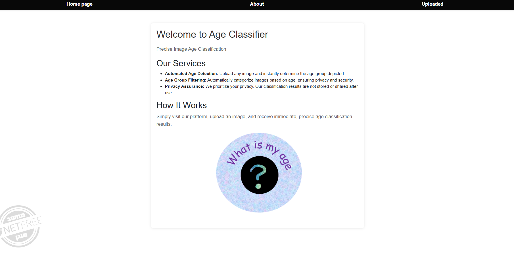
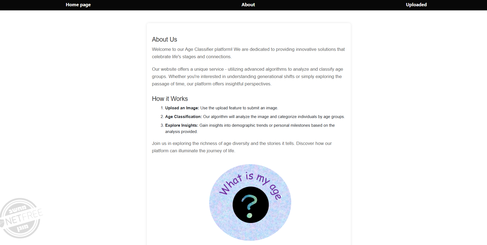
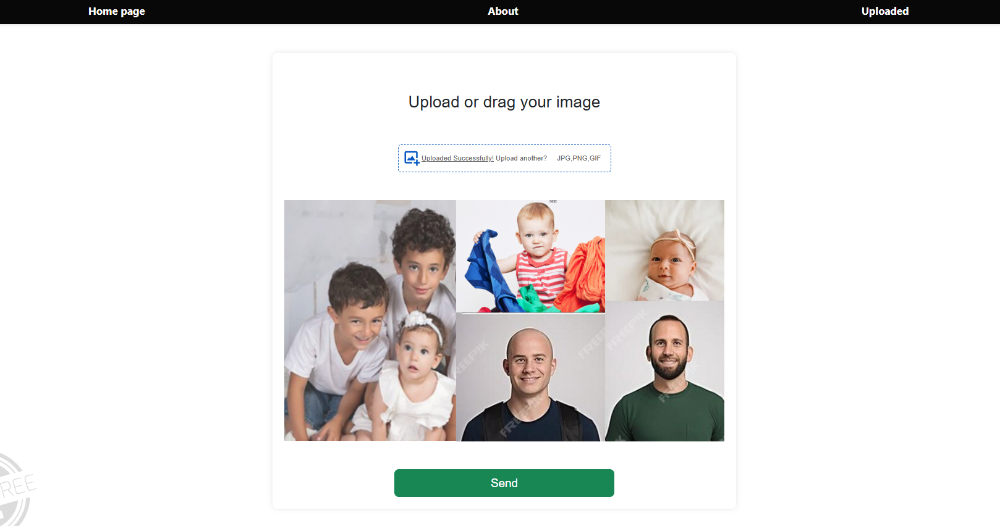
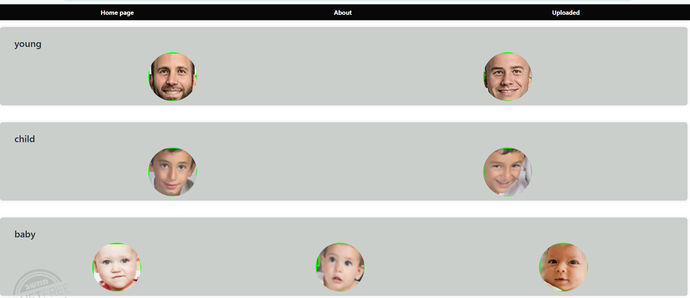

# AI Image Classification Project - Age Group Classification

## Project Overview

This project focuses on AI-based image classification to detect the age group of individuals in images. The system utilizes advanced technologies in Artificial Intelligence and Machine Learning to analyze and classify images based on age groups. The project involved the use of image processing algorithms and deep neural networks. It is a fully independent project, developed to improve skills in AI and to create an efficient and reliable solution for age group classification.

## Technologies Used

- **Backend (Server-side)**: Python
  - Python was used for implementing image classification algorithms, including image preprocessing, training deep neural networks, and setting up the backend server logic.
  - Flask: Flask was used to build the RESTful API that communicates with the frontend, handling image uploads and processing them through the AI model.
  - NumPy: NumPy is used for handling numerical computations efficiently, especially in image processing and model training.
  - TensorFlow/PyTorch: These deep learning frameworks were used for developing and training convolutional neural networks (CNNs) for the image classification task.
  - OpenCV: OpenCV is used for preprocessing the images before they are passed into the model, performing operations like resizing, normalizing, and enhancing images for better accuracy.
- **Frontend (Client-side)**: React
  - React was used for creating an interactive and user-friendly interface, allowing users to upload images and view results from the classification process.
  - TypeScript: TypeScript was used to enhance code quality and maintainability by providing strong typing for JavaScript, which helped reduce bugs and improve developer productivity.
  - Axios: Axios is used to handle HTTP requests between the React frontend and Flask backend, making it easy to upload images and receive the classification results.
  - SCSS: SCSS was used for styling the frontend, creating a clean and responsive design that works well on both desktop and mobile devices.

## Key Features

- **Age Group Classification**: The system classifies individuals in images into specific age groups (e.g., child, teenager, adul, senior).
- **Deep Learning**: Utilized deep neural networks (CNNs) for image classification tasks, ensuring high accuracy and performance.
- **Image Processing**: Implemented various image preprocessing techniques to improve the quality of input images for better classification results.

## Development Process

- **Clean Code Practices**: Emphasis was placed on writing clean, maintainable, and readable code, following industry standards.
- **Deadline Management**: The project was developed while adhering to strict deadlines, ensuring all milestones were met on time.

## Setup and Installation

1. **Clone the repository**:
   ```bash
   git clone https://github.com/your-username/ai-age-group-classification.git
2. **Install Dependencies**:
- **For the server-side (Python)**:
    cd server
    ```bash
    pip install -r requirements.txt
    ```
- **For the client-side (React)**
   cd client
    ```bash
   npm install
   ```
3. **Run the Server**:
   ```bash
   python server.py
   ```
4. **Run the Client**:
  ```bash
   npm start
   ```

   ## homePage 

## about

## uplode

## result



